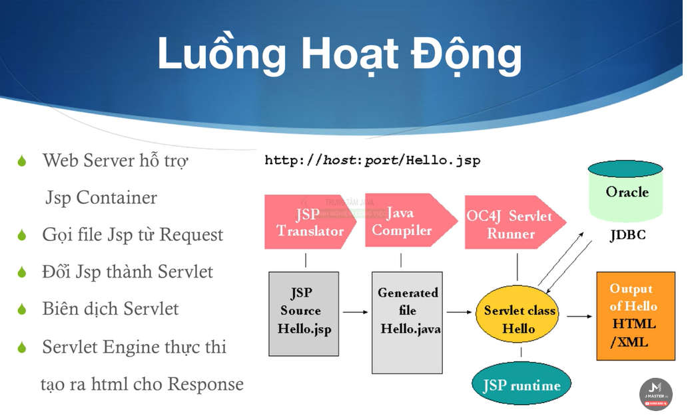
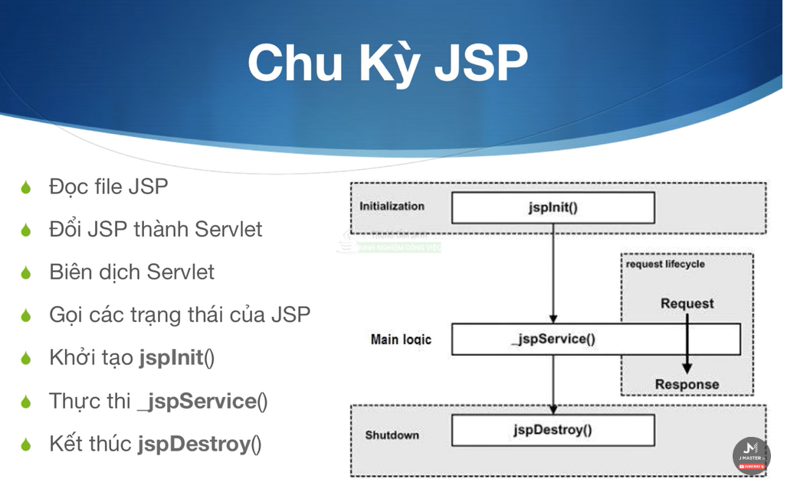
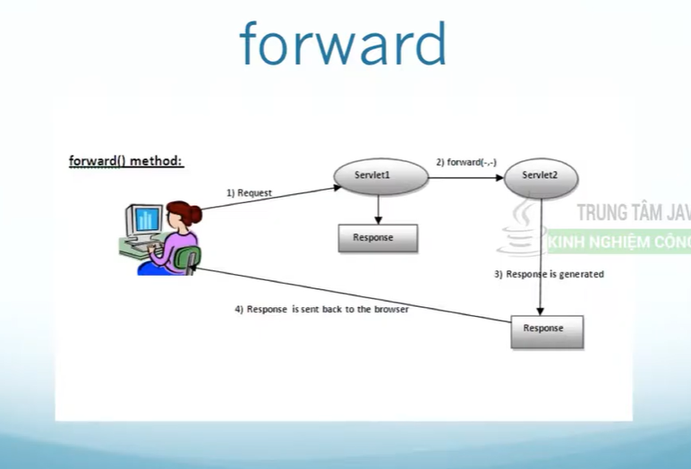
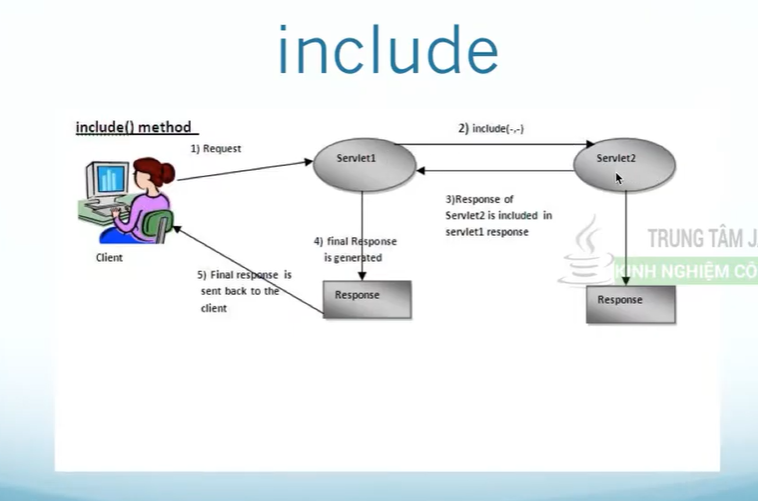

# 01 Giới thiệu về JSP
- JavaServer Pages (JSP) công nghệ viết web động
- Sử dụng <% ... %> để viết code java trong HTML
- JSP viết trên nền Java Servlet
- Giúp developers dễ dàng code và tích hợp modules
  
  
- Sử dụng:
  - <%...code java...%>: trong file jsp để chèn code java vào trong HTML
  - Code java sẽ chạy trước để tạo ra kết quả kết hợp với code HTML của trang JSP
  - <%=...expression java...%>: in ra giá trị trong java thành HTML
  - <%!...khai báo java...%>: ít dùng
  - <%--...comment java...%>
  - Directives: ảnh hưởng đến toàn cấu trúc của Servlet
    - <%@ include ...%>: bao gồm 1 file jsp khác
    - <%@ taglib ...%>: thêm một bộ thư viện vào file jsp cho việc sử dụng
    - jsp:include: bao gồm nội dung một file jsp khác
- Implicit Object: các đối tượng ngầm định trong file jsp, không cần include
  - request: là HttpServletRequest
  - response: là HttpServletResponse
  - out: là PrintWriter
  - session: là HttpSession
  - application là ServletContext
  - config là ServletConfig
# 02 JSP - ví dụ Hello World
# 03 JSP - HttpServletRequest
# 04 JSP - HttpServletResponse
# 05 JSP Form
# 06 JSP Filter
# 07 JSP Session
# 08 JSP Cookies
# 09 Servlet/JSP - MVC Design Pattern
- M: Model: Class mô phỏng đối tượng trong chương trình
- V: View: File .jsp trong chương trình
- C: Controller: các servlet đóng vai trò điều hướng đẩy request qua RequestDispatcher
- Tìm hiểu MVC pattern + DAO pattern
# 10 Java Servlet - RequestDispatcher trong Java Servlet
- Phân phối request tới các nguồn tài nguyên khác
- 2 phương thức chính là forward() và include()
  
  
# 11 Làm Giỏ Hàng bằng HttpSession Đơn giản